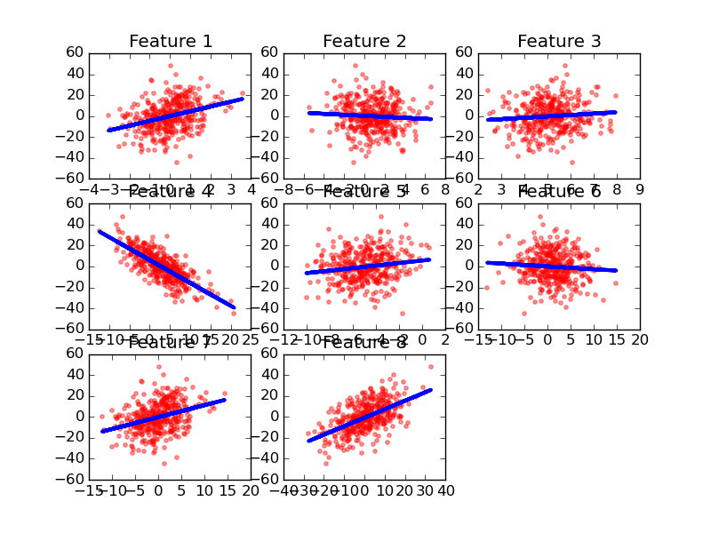
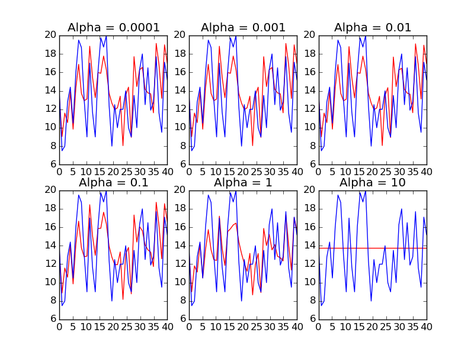
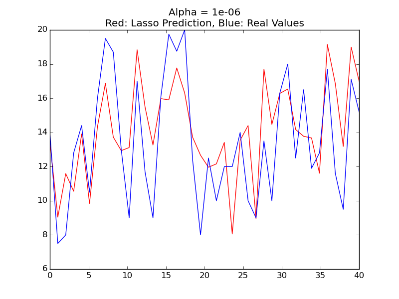

# Linear-Regression-on-Student-Grades-Data
##Implementing and Analysing Linear Regression on a Data Set of Student Grades

    

        
    

    

        Linear Regression
    

    

        
    

    

        Lasso Regression
    

    

        
    

    

        Lasso Regression
    

Implementation of a Simple Linear Regression and Lasso on 2 different datasets. Various evaluation metrics like RSS, R2, AIC and LOOCV were calculated and analyzed, on both train and test sets. Backward and Forward methods of model selection were examined and results were compared as first project of Statistical Machine Learning course
